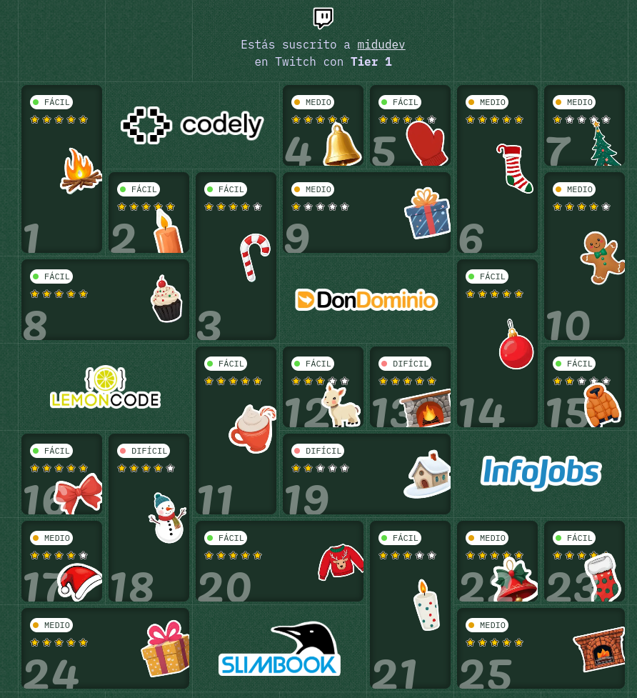

# AdventJS 2024

Midu Dev's 25 solutions to AdventJS 2024 challenges

Welcome! In this repository you will find my solutions to the 24 AdventJS 2024 challenges, created by Midu Dev. If you want to learn more about these challenges, you can check the details in the following [link](https://adventjs.dev/).

Read article: [Link - en-EN](https://medium.com/@cpadlab/all-my-solutions-to-midudevs-adventjs-2024-25-python-javascript-and-typescript-programming-bf1f0bcdbde7)

With this repository, you will be able to solve the 25 AdventJS challenges, obtaining a total of 102 stars out of 125, as well as 2 secret, 2 pro, and finally, the 6 basic achievements.

## Table
 
| **Nº** | **Challenge** | **Source** | **Stars** |
|--------|--------|-----------|----------|
| 1 | [Link](https://adventjs.dev/es/challenges/2024/1) | [Source](./2024/reto-01/) Python, TypeScript | | ⭐⭐⭐⭐⭐ / 5 |
| 2 | [Link](https://adventjs.dev/es/challenges/2024/2) | [Python](./2024/) |  | ⭐⭐⭐⭐⭐ / 5 |
| 3 | [Link](https://adventjs.dev/es/challenges/2024/3) | [Python](./2024/reto-03.py) |  | ⭐⭐⭐⭐ / 5 |
| 4 | [Link](https://adventjs.dev/es/challenges/2024/4) | [Source](./2024/reto-04/) Python, JavaScript |  | ⭐⭐⭐⭐⭐ / 5 |
| 5 | [Link](https://adventjs.dev/es/challenges/2024/5) | [Python](./2024/reto-05.py) |  | ⭐⭐⭐⭐ / 5 |
| 6 | [Link](https://adventjs.dev/es/challenges/2024/6) | [Source](./2024/reto-06/) Python, TypeScript |  | ⭐⭐⭐⭐⭐ / 5 |
| 7 | [Link](https://adventjs.dev/es/challenges/2024/7) | [Python](./2024/reto-07.py) |  | ⭐ / 5 |
| 8 | [Link](https://adventjs.dev/es/challenges/2024/8) | [JavaScript](./2024/reto-08.js) |  | ⭐⭐⭐⭐⭐ / 5 |
| 9 | [Link](https://adventjs.dev/es/challenges/2024/9) | [Python](./2024/reto-09.py) |  | ⭐ / 5 |
| 10 | [Link](https://adventjs.dev/es/challenges/2024/10) | [JavaScript](./2024/reto-10.js) |  | ⭐⭐⭐⭐ / 5 |
| 11 | [Link](https://adventjs.dev/es/challenges/2024/11) | [Python](./2024/reto-11.py) |  | ⭐⭐⭐⭐⭐ / 5 |
| 12 | [Link](https://adventjs.dev/es/challenges/2024/12) | [Python](./2024/reto-12.py) |  | ⭐⭐⭐ / 5 |
| 13 | [Link](https://adventjs.dev/es/challenges/2024/13) | [JavaScript](./2024/reto-13.js) |  | ⭐⭐⭐⭐⭐ / 5 |
| 14 | [Link](https://adventjs.dev/es/challenges/2024/14) | [Python](./2024/reto-14.py) |  | ⭐⭐⭐⭐⭐ / 5 |
| 15 | [Link](https://adventjs.dev/es/challenges/2024/15) | [Python](./2024/reto-15.py) |  | ⭐ / 5 |
| 16 | [Link](https://adventjs.dev/es/challenges/2024/16) | [Python](./2024/reto-16.py) |  | ⭐⭐⭐⭐⭐ / 5 |
| 17 | [Link](https://adventjs.dev/es/challenges/2024/17) | [JavaScript](./2024/reto-17.js) |  | ⭐⭐⭐⭐ / 5 |
| 18 | [Link](https://adventjs.dev/es/challenges/2024/18) | [TypeScript](./2024/reto-18.ts) |  | ⭐⭐⭐⭐ / 5 |
| 19 | [Link](https://adventjs.dev/es/challenges/2024/19) | [TypeScript](./2024/reto-19.ts) |  | ⭐⭐ / 5 |
| 20 | [Link](https://adventjs.dev/es/challenges/2024/20) | [Python](./2024/reto-20.py) |  | ⭐⭐⭐⭐⭐ / 5 |
| 21 | [Link](https://adventjs.dev/es/challenges/2024/21) | [Python](./2024/reto-21.py) |  | ⭐⭐⭐ / 5 |
| 22 | [Link](https://adventjs.dev/es/challenges/2024/22) | [Python](./2024/reto-22.py) |  | ⭐⭐⭐⭐⭐ / 5 |
| 23 | [Link](https://adventjs.dev/es/challenges/2024/23) | [TypeScript](./2024/reto-23.ts) |  | ⭐⭐⭐⭐⭐ / 5 |
| 24 | [Link](https://adventjs.dev/es/challenges/2024/24) | [JavaScript](./2024/reto-24.js) |  | ⭐⭐⭐⭐⭐ / 5 |
| 25 | [Link](https://adventjs.dev/es/challenges/2024/25) | [JavaScript](./2024/reto-25.js) |  | ⭐⭐⭐⭐⭐ / 5 |

