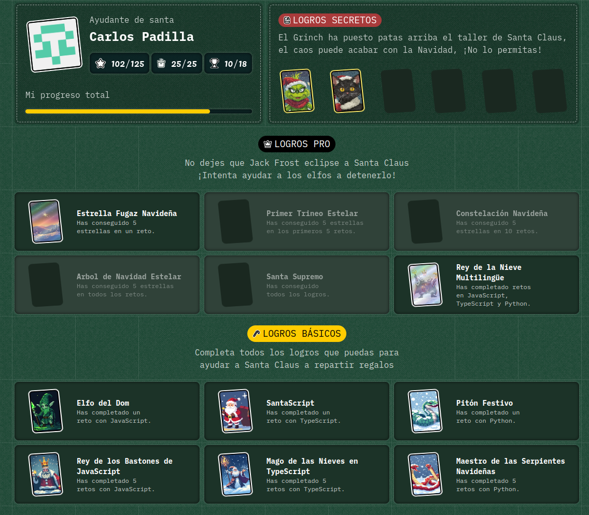
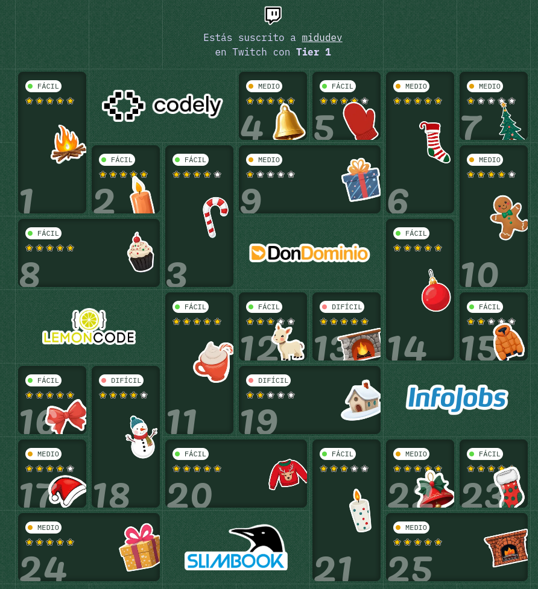

# AdventJS 2024

Midu Dev's 25 solutions to AdventJS 2024 challenges

Welcome! In this repository you will find my solutions to the 24 AdventJS 2024 challenges, created by Midu Dev. If you want to learn more about these challenges, you can check the details in the following [link](https://adventjs.dev/).

Read article: [Link - en-EN](https://medium.com/@cpadlab/all-my-solutions-to-midudevs-adventjs-2024-25-python-javascript-and-typescript-programming-bf1f0bcdbde7)

With this repository, you will be able to solve the 25 AdventJS challenges, obtaining a total of 102 stars out of 125, as well as 2 secret, 2 pro, and finally, the 6 basic achievements.

## Table
 
| **Nº** | **Challenge** | **Source** | **Stars** |
|-|-|-|-|
| 1 | [First gift repeated!](https://adventjs.dev/es/challenges/2024/1) | [Python](https://github.com/cpadlab/AdventJS/blob/237ef090b780cfcffeb2fa3cd4b656ee09e860e1/2024/Challenge%20%231%3A%20First%20gift%20repeated!/challenge-1.py), [TypeScript](https://github.com/cpadlab/AdventJS/blob/237ef090b780cfcffeb2fa3cd4b656ee09e860e1/2024/Challenge%20%231%3A%20First%20gift%20repeated!/challenge-1.ts) | ⭐⭐⭐⭐⭐ |
| 2 | [Framing names](https://adventjs.dev/es/challenges/2024/2) | [Python](https://github.com/cpadlab/AdventJS/blob/237ef090b780cfcffeb2fa3cd4b656ee09e860e1/2024/Challenge%20%232%3A%20Framing%C2%A0names.py) | ⭐⭐⭐⭐⭐ |
| 3 | [Organizing the inventory](https://adventjs.dev/es/challenges/2024/3) | [Python](https://github.com/cpadlab/AdventJS/blob/237ef090b780cfcffeb2fa3cd4b656ee09e860e1/2024/Challenge%20%233%3A%20Organizing%20the%20inventory.py) | ⭐⭐⭐⭐ |
| 4 | [ Decorating the Christmas tree](https://adventjs.dev/es/challenges/2024/4) | [Python](https://github.com/cpadlab/AdventJS/blob/237ef090b780cfcffeb2fa3cd4b656ee09e860e1/2024/Challenge%20%234%3A%20Decorating%20the%20Christmas%20tree/challenge-4.py), [JavaScript](https://github.com/cpadlab/AdventJS/blob/237ef090b780cfcffeb2fa3cd4b656ee09e860e1/2024/Challenge%20%234%3A%20Decorating%20the%20Christmas%20tree/challenge-4.js) | ⭐⭐⭐⭐⭐ |
| 5 | [Shoe pairing](https://adventjs.dev/es/challenges/2024/5) | [Python](https://github.com/cpadlab/AdventJS/blob/237ef090b780cfcffeb2fa3cd4b656ee09e860e1/2024/Challenge%20%235%3A%20Shoe%20pairing.py) | ⭐⭐⭐⭐ |
| 6 | [Is the gift inside the box?](https://adventjs.dev/es/challenges/2024/6) | [Python](https://github.com/cpadlab/AdventJS/blob/237ef090b780cfcffeb2fa3cd4b656ee09e860e1/2024/Challenge%20%236%3A%20Is%20the%20gift%20inside%20the%20box%3F/challenge-6.py), [TypeScript](https://github.com/cpadlab/AdventJS/blob/237ef090b780cfcffeb2fa3cd4b656ee09e860e1/2024/Challenge%20%236%3A%20Is%20the%20gift%20inside%20the%20box%3F/challenge-6.ts) | ⭐⭐⭐⭐⭐ |
| 7 | [The Grinch’s attack](https://adventjs.dev/es/challenges/2024/7) | [Python](https://github.com/cpadlab/AdventJS/blob/237ef090b780cfcffeb2fa3cd4b656ee09e860e1/2024/Challenge%20%237%3A%20The%20Grinch%E2%80%99s%20attack.py) | ⭐ |
| 8 | [The reno race](https://adventjs.dev/es/challenges/2024/8) | [JavaScript](https://github.com/cpadlab/AdventJS/blob/237ef090b780cfcffeb2fa3cd4b656ee09e860e1/2024/Challenge%20%238%3A%20The%20reno%20race.js) | ⭐⭐⭐⭐⭐ |
| 9 | [The magic train](https://adventjs.dev/es/challenges/2024/9) | [Python](https://github.com/cpadlab/AdventJS/blob/237ef090b780cfcffeb2fa3cd4b656ee09e860e1/2024/Challenge%20%239%3A%20The%20magic%20train.py) | ⭐ |
| 10 | [The elfish assembler](https://adventjs.dev/es/challenges/2024/10) | [JavaScript](https://github.com/cpadlab/AdventJS/blob/237ef090b780cfcffeb2fa3cd4b656ee09e860e1/2024/Challenge%20%2310%3A%20The%20elfish%20assembler.js) | ⭐⭐⭐⭐ |
| 11 | [Filenames encoded](https://adventjs.dev/es/challenges/2024/11) | [Python](https://github.com/cpadlab/AdventJS/blob/237ef090b780cfcffeb2fa3cd4b656ee09e860e1/2024/Challenge%20%2311%3A%20Filenames%20encoded.py) | ⭐⭐⭐⭐⭐ |
| 12 | [How much does the tree cost?](https://adventjs.dev/es/challenges/2024/12) | [Python](https://github.com/cpadlab/AdventJS/blob/237ef090b780cfcffeb2fa3cd4b656ee09e860e1/2024/Challenge%20%2312%3A%20How%20much%20does%20the%20tree%20cost%3F.py) | ⭐⭐⭐ |
| 13 | [Is the robot back?](https://adventjs.dev/es/challenges/2024/13) | [JavaScript](https://github.com/cpadlab/AdventJS/blob/237ef090b780cfcffeb2fa3cd4b656ee09e860e1/2024/Challenge%20%2313%3A%20Is%20the%20robot%20back%3F.js) | ⭐⭐⭐⭐⭐ |
| 14 | [Weaving the reno](https://adventjs.dev/es/challenges/2024/14) | [Python](https://github.com/cpadlab/AdventJS/blob/237ef090b780cfcffeb2fa3cd4b656ee09e860e1/2024/Challenge%20%2314%3A%20Weaving%20the%20reno.py) | ⭐⭐⭐⭐⭐ |
| 15 | [Drawing tables](https://adventjs.dev/es/challenges/2024/15) | [Python](https://github.com/cpadlab/AdventJS/blob/237ef090b780cfcffeb2fa3cd4b656ee09e860e1/2024/Challenge%20%2315%3A%20Drawing%20tables.py) | ⭐ |
| 16 | [Cleaning the snow path](https://adventjs.dev/es/challenges/2024/16) | [Python](https://github.com/cpadlab/AdventJS/blob/237ef090b780cfcffeb2fa3cd4b656ee09e860e1/2024/Challenge%20%2316%3A%20Cleaning%20the%20snow%20path.py) | ⭐⭐⭐⭐⭐ |
| 17 | [Grinch’s bombs](https://adventjs.dev/es/challenges/2024/17) | [JavaScript](https://github.com/cpadlab/AdventJS/blob/237ef090b780cfcffeb2fa3cd4b656ee09e860e1/2024/Challenge%20%2317%3A%20Grinch%E2%80%99s%20bombs.js) | ⭐⭐⭐⭐ |
| 18 | [Santa’s Magic Agenda](https://adventjs.dev/es/challenges/2024/18) | [TypeScript](https://github.com/cpadlab/AdventJS/blob/237ef090b780cfcffeb2fa3cd4b656ee09e860e1/2024/Challenge%20%2318%3A%20Santa%E2%80%99s%20Magic%20Agenda.ts) | ⭐⭐⭐⭐ |
| 19 | [Stack magical boxes to deliver gifts](https://adventjs.dev/es/challenges/2024/19) | [TypeScript](https://github.com/cpadlab/AdventJS/blob/237ef090b780cfcffeb2fa3cd4b656ee09e860e1/2024/Challenge%20%2319%3A%20Stack%20magical%20boxes%20to%20deliver%20gifts.ts) | ⭐⭐ |
| 20 | [Find missing and duplicate gifts](https://adventjs.dev/es/challenges/2024/20) | [Python](https://github.com/cpadlab/AdventJS/blob/237ef090b780cfcffeb2fa3cd4b656ee09e860e1/2024/Challenge%20%2320%3A%20Find%20missing%20and%20duplicate%20gifts.py) | ⭐⭐⭐⭐⭐ |
| 21 | [Calculate the height of the Christmas tree](https://adventjs.dev/es/challenges/2024/21) | [Python](https://github.com/cpadlab/AdventJS/blob/237ef090b780cfcffeb2fa3cd4b656ee09e860e1/2024/Challenge%20%2321%3A%20Calculate%20the%20height%20of%20the%20Christmas%20tree.py) | ⭐⭐⭐ |
| 22 | [Generate gift combinations](https://adventjs.dev/es/challenges/2024/22) | [Python](https://github.com/cpadlab/AdventJS/blob/237ef090b780cfcffeb2fa3cd4b656ee09e860e1/2024/Challenge%20%2322%3A%20Generate%20gift%20combinations.py) | ⭐⭐⭐⭐⭐ |
| 23 | [Find the missing numbers](https://adventjs.dev/es/challenges/2024/23) | [TypeScript](https://github.com/cpadlab/AdventJS/blob/237ef090b780cfcffeb2fa3cd4b656ee09e860e1/2024/Challenge%20%2323%3A%20Find%20the%20missing%20numbers.ts) | ⭐⭐⭐⭐⭐ |
| 24 | [ Check if trees are magical mirrors](https://adventjs.dev/es/challenges/2024/24) | [JavaScript](https://github.com/cpadlab/AdventJS/blob/237ef090b780cfcffeb2fa3cd4b656ee09e860e1/2024/Challenge%20%2324%3A%20Check%20if%20trees%20are%20magical%20mirrors.js) | ⭐⭐⭐⭐⭐ |
| 25 | [Execute the magical language](https://adventjs.dev/es/challenges/2024/25) | [JavaScript](https://github.com/cpadlab/AdventJS/blob/237ef090b780cfcffeb2fa3cd4b656ee09e860e1/2024/Challenge%20%2325%3A%20Execute%20the%20magical%20language.js) | ⭐⭐⭐⭐⭐ |

